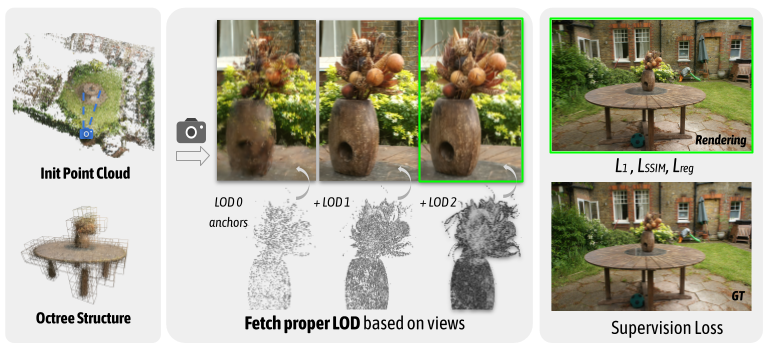
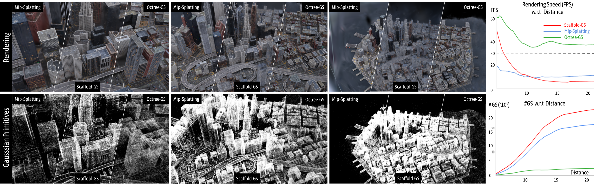

# *Octree*-GS: Towards Consistent Real-time Rendering with LOD-Structured 3D Gaussians

### [Project Page](https://city-super.github.io/octree-gs/) | [Paper](https://arxiv.org/abs/2403.17898)

[Kerui Ren*](https://github.com/tongji-rkr), [Lihan Jiang*](https://jianglh-whu.github.io/), [Tao Lu](https://github.com/inspirelt), [Mulin Yu](https://scholar.google.com/citations?user=w0Od3hQAAAAJ), [Linning Xu](https://eveneveno.github.io/lnxu), [Zhangkai Ni](https://eezkni.github.io/), [Bo Dai](https://daibo.info/) ✉️ <br />

## News

**[2024.04.01]** 🎈👀 The [viewer](https://github.com/city-super/Octree-GS/tree/main/SIBR_viewers) for Octree-GS is available now. 

**[2024.04.01]** We release the code.


## Overview
<p align="center">

</p>
  Inspired by the Level-of-Detail (LOD) techniques,
  we introduce \modelname, featuring an LOD-structured 3D Gaussian approach supporting level-of-detail decomposition for scene representation that contributes to the final rendering results.
  Our model dynamically selects the appropriate level from the set of multi-resolution anchor points, ensuring consistent rendering performance with adaptive LOD adjustments while maintaining high-fidelity rendering results.
<p align="center">

</p>
## Installation

We tested on a server configured with Ubuntu 18.04, cuda 11.6 and gcc 9.4.0. Other similar configurations should also work, but we have not verified each one individually.

1. Clone this repo:
```
git clone https://gitlab.pjlab.org.cn/renkerui/Octree-GS.git --recursive
cd Octree-GS
```

2. Install dependencies
```
SET DISTUTILS_USE_SDK=1 # Windows only
conda env create --file environment.yml
conda activate octree_gs
```

## Data

First, create a ```data/``` folder inside the project path by 
```
mkdir data
```

The data structure will be organised as follows:

```
data/
├── dataset_name
│   ├── scene1/
│   │   ├── images
│   │   │   ├── IMG_0.jpg
│   │   │   ├── IMG_1.jpg
│   │   │   ├── ...
│   │   ├── sparse/
│   │       └──0/
│   ├── scene2/
│   │   ├── images
│   │   │   ├── IMG_0.jpg
│   │   │   ├── IMG_1.jpg
│   │   │   ├── ...
│   │   ├── sparse/
│   │       └──0/
...
```


### Public Data

The BungeeNeRF dataset is available in [Google Drive](https://drive.google.com/file/d/1nBLcf9Jrr6sdxKa1Hbd47IArQQ_X8lww/view?usp=sharing)/[百度网盘[提取码:4whv]](https://pan.baidu.com/s/1AUYUJojhhICSKO2JrmOnCA). The MipNeRF360 scenes are provided by the paper author [here](https://jonbarron.info/mipnerf360/). The SfM data sets for Tanks&Temples and Deep Blending are hosted by 3D-Gaussian-Splatting [here](https://repo-sam.inria.fr/fungraph/3d-gaussian-splatting/datasets/input/tandt_db.zip). Download and uncompress them into the ```data/``` folder.
### Custom Data

For custom data, you should process the image sequences with [Colmap](https://colmap.github.io/) to obtain the SfM points and camera poses. Then, place the results into ```data/``` folder.


## Training

### Training multiple scenes

To train multiple scenes in parallel, we provide batch training scripts: 
 - Tanks&Temples: ```train_tandt.sh```
 - MipNeRF360: ```train_mipnerf360.sh```
 - BungeeNeRF: ```train_bungeenerf.sh```
 - Deep Blending: ```train_db.sh```

 run them with 
 ```
 bash train_xxx.sh
 ```

 > Notice 1: Make sure you have enough GPU cards and memories to run these scenes at the same time.

 > Notice 2: Each process occupies many cpu cores, which may slow down the training process. Set ```torch.set_num_threads(32)``` accordingly in the ```train.py``` to alleviate it.

### Training a single scene
For training a single scene, modify the path and configurations in ```single_train.sh``` accordingly and run it:
```
bash single_train.sh
```

- scene: scene name with a format of ```dataset_name/scene_name/``` or ```scene_name/```;
- exp_name: user-defined experiment name;
- gpu: specify the GPU id to run the code. '-1' denotes using the most idle GPU. 
- ratio: sampling interval of the SfM point cloud at initialization
- appearance_dim: dimensions of appearance embedding
- fork: proportion of subdivisions between LOD levels
- base_layer: the coarsest layer of the octree, corresponding to LOD 0, '<0' means scene-based setting
- dist2level: the way floating-point values map to integers when estimating the LOD level
- update_ratio: the threshold ratio of anchor growing
- progressive: whether to use progressive learning
- levels: The number of LOD levels, '<0' means scene-based setting
- init_level: initial level of progressive learning
- extra_ratio: the threshold ratio of LOD bias
- extra_up: Increment of LOD bias per time
> For these public datasets, the configurations of 'voxel_size' and 'fork' can refer to the above batch training script. 


This script will store the log (with running-time code) into ```outputs/dataset_name/scene_name/exp_name/cur_time``` automatically.

## Evaluation

We've integrated the rendering and metrics calculation process into the training code. So, when completing training, the ```rendering results```, ```fps``` and ```quality metrics``` will be printed automatically. And the rendering results will be save in the log dir. Mind that the ```fps``` is roughly estimated by 

```
torch.cuda.synchronize();t_start=time.time()
rendering...
torch.cuda.synchronize();t_end=time.time()
```

which may differ somewhat from the original 3D-GS, but it does not affect the analysis.

Meanwhile, we keep the manual rendering function with a similar usage of the counterpart in [3D-GS](https://github.com/graphdeco-inria/gaussian-splatting), one can run it by 

```
python render.py -m <path to trained model> # Generate renderings
python metrics.py -m <path to trained model> # Compute error metrics on renderings
```

## Viewer

The viewer for Octree-GS is available now. 

## Contact

- Kerui Ren: renkerui@pjlab.org.cn
- Lihan Jiang: mr.lhjiang@gmail.com

## LICENSE

Please follow the LICENSE of [3D-GS](https://github.com/graphdeco-inria/gaussian-splatting).

## Acknowledgement

We thank all authors from [3D-GS](https://github.com/graphdeco-inria/gaussian-splatting) and [Scaffold-GS](https://github.com/city-super/Scaffold-GS) for presenting such an excellent work.

